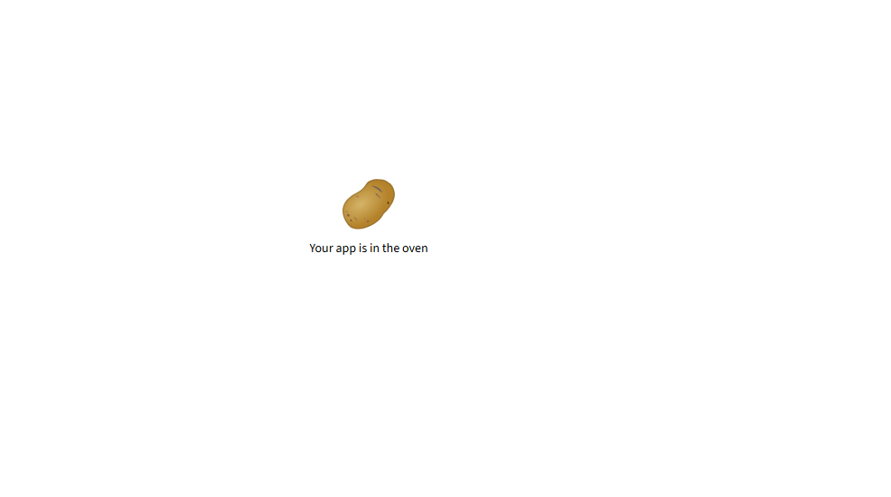

# Streamlit Spam Detector App

This is a simple **Spam Message Classifier** built using Python, Streamlit, and Scikit-learn. It uses a **Naive Bayes classifier** to detect whether a given SMS message is spam or not.

The app provides a clean user interface to input any message, and the model will predict if it's **SPAM** or **NOT SPAM** in real-time.

## Screenshot

